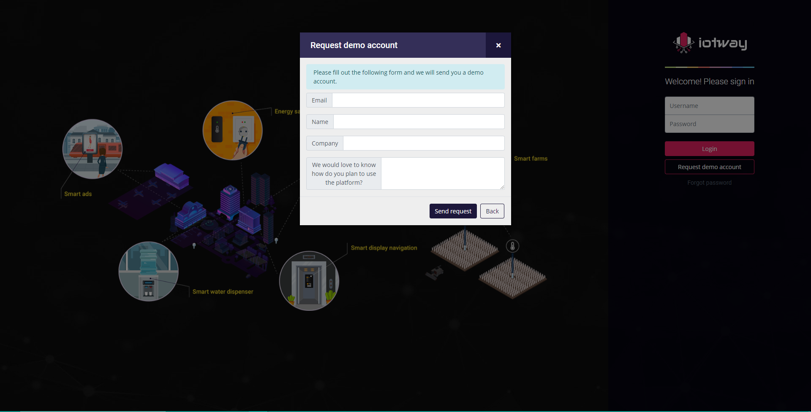

# Entrada y salida de datos con Wyliodrin para Raspberry Pi.
## 1.Planteamiento del Problema
Realizar una investigacion de I/O de datos para raspberry pi ademas del uso de wyliodrin para esta misma investigacion 
## 2.Objetivos:
### General
 - Analizar la entrada y salida de datos de Raspberry Pi a través de la plataforma Wyliodrin
### Específicos
 - Aplicar conceptos de programación mediante la creación de un programa funcional que permita la entrada y salida de datos en una Raspberry pi
 - Implementar la simulación de un circuito funcional con entrada y salida de datos mediante la plataforma Wyliodrin
 - Comprender conceptos de entrada y de salida de datos.

## 3.Estado del Arte


Las 3 investigaciones analizadas anteriormente cuenta con su aportación propia para nuestro trabajo de investigación, las cuales son:
 - Recopilar y enviar datos mediante los distintos puertos de nuestra Raspberry nos puede ayudar en procesos industriales y de automatización ya que nos permite procesar información a bajo costo.
 - Plataformas como Wyliondrin nos permite desarrollar habilidades dentro del campo del IoT, permitiéndonos diseñar un sistema de IoT sin la necesidad de contar con los componentes físicos.
 - Raspberry nos permite adquirir conocimientos de computación y programación a muy bajo costo al ser una plataforma muy asequible.
 
## 4.Marco Teórico
### ¿Que es la entrada y salida de datos?
El ordenador (en este caso la Raspberry, que es una serie de ordenadores) necesita dispositivos que extraigan datos del exterior y los meta dentro de él para poder operar con ellos. Estos componentes se conocen como elementos de entrada de datos.
En un algoritmo, los datos de entrada son los que la computadora va a procesar.
Los datos de salida son datos que son obtenidos a partir de los datos de entrada. A los datos de salida se les considera más significativos que a los datos de entrada. Sin embargo, en un sentido más filosófico, a los datos de entrada se les considera la materia prima de los datos de salida, considerados estos como la verdadera información.
En resumidas cuentas, la entrada de datos nos sirve como materia prima para lo que queremos representar posteriormente, y dicha representación es la salida la cual es información útil.


### ¿Qué es Wyliodrin?


Wyliodrin es un portal que entrega un entorno de programación visual, directamente sobre el navegador, este entorno permite la conexión y trabajo sobre las siguientes placas:
 - Raspberry Pi
 - Intel Galileo
El procedimiento de enlace entre Wyliodrin y un Raspberry Pi es un poco más complicado de lo que se espera, (implica descargar una imagen de gran tamaño para la tarjeta SD, y luego un archivo adicional), pero una vez que está hecho, Wyliodrin habilita al usuario a programar diferentes funciones, que pueden ser tan sencillas como conectarse a una estación de radio e ingresar a redes sociales, o mucho más avanzadas, como asignar órdenes a un robot. Pero en este caso específico se lo usará para realizar cosas más simples, como son ejemplos de entrada y salida de datos.
Para quienes gusten o dominen la programación tienen la chance de dejar a un lado todo el aspecto visual, y programar en C, Java y PHP con Wyliodrin, pero si una sola línea de código resulta aterradora, el “estilo Scratch” será mucho más sencillo de asimilar entre los principiantes. Sin embargo hay que tomar en cuenta que solo podremos simular con Java, para ser mas precisos con jode js. Wyliodrin concede la conexión de un sólo dispositivo y la creación de tres proyectos en sus cuentas gratuitas, y quien necesite más recursos podrá acceder a planes de suscripción que comienzan por debajo de los cuatro dólares mensuales.
**Ventajas**
Esta herramienta tiene características particulares que representan una ventaja para el usuario, y estas son:
 - Permite la programación y el control de dispositivos embebidos directamente desde un navegador
 - El usuario puede escribir, almacenar y ejecutar sus programas. El apartado del almacenamiento es importante ya que no todas las herramientas de este tipo permiten esto.
 - Se puede modificar y ver los parámetros de la placa en tiempo real, sin importar dónde se encuentra la placa
 - Con Wyliodrin programar no es un problema. Puedes programar tus placas usando su sistema de programación visual. Arrastra y suelta los bloques y Wyliodrin escribirá el código por tí.
 - Durante la programación de dispositivos embebidos por lo general tienen que estar conectados al ordenador. Con Wyliodrin, el dispositivo debe estar conectado sólo a la Internet a través de un cable o WiFi. De esta manera, puedes construir coches o robots que pueden moverse a tu alrededor mientras que estás programando.
### Entorno de Wyliodrin
Esta herramienta nos ofrece varios apartados para poder llevar a cabo nuestro proyecto, estos apartados se integran dentro de su entorno de trabajo, el cual a continuación va a ser explicado a detalle:
 - **Aplicación:** Es la pestaña que nos permite escrbir el código fuente acorde al lenguaje de programación que hayamos elegido, también nos puede mostrar el código que se genera en segundo plano si es que programamos de manera visual.
 
 
 
 - **Tablero de control:**  En esta pestaña podemos añadir unidades de salida a manera de representación visual que complementen nuestro proyecto. Este apartado tiene funciones parecidas a los nodos que encontramos en la librería dashboard de node-red.
 
 
 
 - **Block de Notas:** en esta pestaña podemos añadir comentarios importantes, aunque se lo puede realizar en el código como tal, este apartado nos permite organizar nuestras notas de mejor manera.
 
 
 
  - **Shell:** Esta pestaña nos indica el estado de la placa en caso de que la tengamos conectada de manera física, si no se la tiene conectada nos presentara lo siguiente que es totalmente normal y no es ningún impedimento para continuar con nuestro proyecto.
 
 [](img/9.png)
 
 - **Placa:** En esta pestaña podremos ver lo que sucede en nuestra placa conectada o en este caso en particular podremos simular sobre una Raspberry Pi, en la cual podremos presenciar nuestros resultados.
 
 [](img/10.png)
 
 - **Herramientas** En el siguiente apartado se explicara mediante una imagen lo que estas opciones que nos brinda la herramienta nos permite hacer.
 
 [](img/11.png)

Dentro del menú de este último apartado podemos encontrar una librería que nos va a servir de gran ayuda, la cual se encuentra localizada y explicada en la siguiente ubicación:

[](img/12.png)

Libreria onoff GPIO:
**crear (pin, estado) ->** crea un objeto desde el que puede controlar los pines GPIO en la RaspberryPi. El parámetro de estado es una cadena e indica el tipo de entrada / salida del pin
**readSync () ->** devuelve el valor leído por el pin 1/0

**writeSync (valor) ->** envía en el pin GPIO el valor seleccionado 1/0

**direction () ->** devuelve el estado del pin

**setDirection (estado) ->** cambiar el estado del pin

**activeLow () ->** devuelve el estado de la propiedad activeLow del pin

**setActiveLow (valor) ->** cambiar la propiedad activeLow en el pin

## 5.Diagramas

**Juego de luces**

Para realizar pruebas de raspberry y Wyliodrin debemos contar con un generador de circuitos que nos permite exportar nuestros proyectos en formato SVG y XML. En este caso nuestro circuito será realizado con la plataforma Fritzing la cual es recomendada por Wyliodrin para subir nuestros esquemas.


El siguiente diagrama representa de manera visual y esquemática un juego de luces compuesto con 5 diodos led y 3 pulsadores, cada pulsador mostrará un ciclo distinto al ser pulsado.


Al momento de subir nuestro circuito a Wyliodrin se nos mostrará una tabla de componentes con la información de cada pin de nuestra GPIO y el elemento que tiene conectado  en caso de haber un error no se mostrará la tabla y no funcionara nuestra simulación.

## 6.Lista de Componentes

**Juego de Luces**
Según el diagrama mostrado anteriormente solo se usaban diodos y pulsadores conectados directamente, esto no es lo más recomendable de realizar en la implementación real ya que podríamos generar excesos de corrientes o voltajes por lo que es necesario agregar componentes adicionales:
 - Raspberry Pi
 - 5 Diodos LED
 - 5 Resistencias de 220 ohm
 - 3 Botones
 - 3 Resistencias de 4.7k
 ## 7.Mapa de Variables
 **Juegos de luces
 

## 8.Explicacion de codigo fuente
 ```
 var Gpio = require("onoff").Gpio;//iniciamos la libreria complatible con Wyliondrin
 
//asignamos las variables a pines de nuestra gpio como salidas en este caso nuestros leds
var led1 = new Gpio(2, "out");
var led2 = new Gpio(3, "out");
var led3 = new Gpio(4, "out");
var led4 = new Gpio(17, "out");
var led5 = new Gpio(27, "out");
 
//asignamos las variables a pines de nuestra gpio como entradas en este caso nuestros interruptores
var interruptor1 = new Gpio(14, "in");
var interruptor2 = new Gpio(15,"in");
var interruptor3 = new Gpio(18,"in");
 
var tiempo=500;//variable para control de tiempo
var estado;//Variable de estado
 
//Mediante la funcion direction() leemos los pines seleccionados en nuestra GPIO para comprobar como han sido configurados
//Almacenamos el estado de nuestros pines en la variable estado
//Mediante una salida de consola informamos la configuracion de nuestros pines al usuario imprimiendo la variable estado
 
console.log("***Juegos de Luces***");
console.log("La configuracion de puertos es la sigiente");
estado=led1.direction();
console.log("Gpio2 configurado como: ");
console.log(estado);
estado=led2.direction();
console.log("Gpio3 configurado como: ");
console.log(estado);
estado=led3.direction();
console.log("Gpio4 configurado como: ");
console.log(estado);
estado=led4.direction();
console.log("Gpio17 configurado como: ");
console.log(estado);
estado=led5.direction();
console.log("Gpio27 configurado como: ");
console.log(estado);
estado=interruptor1.direction();
console.log("Gpio14 configurado como: ");
console.log(estado);
estado=interruptor2.direction();
console.log("Gpio15 configurado como: ");
console.log(estado);
estado=interruptor3.direction();
console.log("Gpio18 configurado como: ");
console.log(estado);
 
//Iniciames nuestro bucle infinito
 
while(1){
//Para la lectura de pines usaremos la funcion readsync() y mediante un if definimos que boton pulsó el usuario
//Contaremos con distintos casos para juegos de luces 
//La funcion encargada de enviar señales a cada salida es writeSync()
//La variable tiempo controlara el tiempo de ejecucion
//Mediante un bucle for repetiremos 5 veces cada juego de luces
 
//Primer juego de luces
if(interruptor1.readSync()===1){
console.log("Juego de luces 1");
for(var i=1;i<=5;i++){
led1.writeSync(1);led2.writeSync(0);led3.writeSync(0);led4.writeSync(0);led5.writeSync(0);
sleep(tiempo);
 
led1.writeSync(0);led2.writeSync(1);led3.writeSync(0);led4.writeSync(0);led5.writeSync(0);
sleep(tiempo);
 
led1.writeSync(0);led2.writeSync(0);led3.writeSync(1);led4.writeSync(0);led5.writeSync(0);
sleep(tiempo);
 
led1.writeSync(0);led2.writeSync(0);led3.writeSync(0);led4.writeSync(1);led5.writeSync(0);
sleep(tiempo);
 
led1.writeSync(0);led2.writeSync(0);led3.writeSync(0);led4.writeSync(0);led5.writeSync(1);
sleep(tiempo);
 
led1.writeSync(0);led2.writeSync(0);led3.writeSync(0);led4.writeSync(1);led5.writeSync(0);
sleep(tiempo);
 
led1.writeSync(0);led2.writeSync(0);led3.writeSync(1);led4.writeSync(0);led5.writeSync(0);
sleep(tiempo);
 
led1.writeSync(0);led2.writeSync(1);led3.writeSync(0);led4.writeSync(0);led5.writeSync(0);
sleep(tiempo);
 
led1.writeSync(1);led2.writeSync(0);led3.writeSync(0);led4.writeSync(0);led5.writeSync(0);
sleep(tiempo);
 
led1.writeSync(0);led2.writeSync(0);led3.writeSync(0);led4.writeSync(0);led5.writeSync(0);
sleep(tiempo);
}
 
//Segundo juego de luces
}else if(interruptor2.readSync()===1){
console.log("Juego de luces 2");
 
for(var i=1;i<=5;i++){
led1.writeSync(1);led2.writeSync(0);led3.writeSync(0);led4.writeSync(0);led5.writeSync(1);
sleep(tiempo);
 
led1.writeSync(0);led2.writeSync(1);led3.writeSync(0);led4.writeSync(1);led5.writeSync(0);
sleep(tiempo);
 
led1.writeSync(0);led2.writeSync(0);led3.writeSync(1);led4.writeSync(0);led5.writeSync(0);
sleep(tiempo);
 
led1.writeSync(0);led2.writeSync(0);led3.writeSync(0);led4.writeSync(0);led5.writeSync(0);
sleep(tiempo);
}
 
//Tercer juego de luces
}else if(interruptor3.readSync()===1){
console.log("Juego de luces 3");
 
for(var i=1;i<=5;i++){
led1.writeSync(0);led2.writeSync(0);led3.writeSync(1);led4.writeSync(0);led5.writeSync(0);
sleep(tiempo);
 
led1.writeSync(0);led2.writeSync(1);led3.writeSync(0);led4.writeSync(1);led5.writeSync(0);
sleep(tiempo);
 
led1.writeSync(1);led2.writeSync(0);led3.writeSync(0);led4.writeSync(0);led5.writeSync(1);
sleep(tiempo);
led1.writeSync(0);led2.writeSync(0);led3.writeSync(0);led4.writeSync(0);led5.writeSync(0);
sleep(tiempo);
}
}
}
```
## 9.Descripción de Prerrequisitos y configuración.
**Juego de luces**
Al ser una simulación en línea no es necesario la implementación de ningún software adicional, únicamente de contar con acceso a internet, en caso de realizar un diseño propio se debe crear primero un esquema en fritzing, el cual es un software portable para el diseño de circuitos electrónicos.

## 10.Aportacion

Internet de las Cosas con Wyliodrin

**1.** Primero dado a que la version .io es la unica en al cual podemos usar wyliodrin con una raspberry entonces se debe comprar o para realizar un test se puede solicitar una cuanta demo


Descargar imagen de Wyliodrin, utilizando el software 7 zip para
descomprimir despues escribir la imagen de Wyliodrin en la SD, utilizando el software Win32
Disk Imager.

Insertar la SD en la Raspberry Pi.

Ingresar a la Wyliodrin Projects page y configurar. En las siguientes
imágenes veremos el proceso completo de la creación y conexión de la
raspberry a la interfaz de wyliodrin.
En la primera imagen podemos ver la cuenta asociada al grupo de
investigación TIGUM, y ver la conexión que tiene en el proceso de
programación.


**6.** Luego de ver el estado de la cuenta, empezamos a crear una carpeta
general y definir el dispositivo que iremos a conectar en este caso la
raspberry pi.


Luego de esto debemos conectar y crear el proyecto, donde debemos
seguir los pasos por defecto que nos da wyliodrin.


Luego configuramos el lenguaje de programación, donde podemos
escoger entre más de 20 lenguajes y la configuración de la conexión de
la raspberry a internet


Luego de que tengamos listo el programa en el cual vamos hacer actuar
nuestra raspberry pi, por ejemplo: podemos observar en la imagen el
programa final para tomar una foto donde a su derecha esta su
traduccion a los demas idioma como son Python y Java para poder observar la foto debemos extraerla con una serie de
comandos, para poderlo hacer debeos insertar una usb a la raspberry pi,
la segundo que debemos hacer, es actuar en la Shell los siguientes
comandos.


Luego de que tengamos listo el programa debemos abrir el Shell o
tablero, donde de inmediato tomara la foto y la guardara, pero no es
posible observarla desde la interfaz de programación y en el Shell.


Donde se verificara los puestos disponibles, luego se creara una carpeta
y se copiara la foto en dicha carpeta


## 11.Conclusiones
Una vez hemos concluido el proyecto, podemos establecer que se tiene claro el concepto de entrada y salida de datos ya que hemos realizado el proceso por completo, el cual funciona con éxito siendo de gran utilidad si se quisiera explicar de manera sencilla y clara los conceptos de entrada y salida mediante ejemplos.

También se ha comprendido y se ha sacado provecho a la herramienta Wyliodrin en la cual pudimos simular y ejecutar un circuito funcional con ayuda de conocimientos básicos de programación.

## 12.Recomendaciones
 - Al momento de realizar nuestro esquema tomar en cuenta que si no aparece un cuadro de conexión este no va funcionar y debemos revisar cada componente ya que nuestro simulador no acepta ciertos componentes electrónicos.
 - El lenguaje predeterminado para el simulador de raspberry es Node.JS por lo que solo debemos trabajar con este lenguaje.

## 13.Cronograma

 

## 14.Bibliografia
Lopez, F., Torres, F. J., Ramirez, V. A., Nunez, D. A., Corona, R., & Lopez, A. R. (2019). Raspberry pi for implementation of web technology in an automation process. 2019 IEEE International Autumn Meeting on Power, Electronics and Computing, ROPEC 2019, (Ropec), 2–7. https://doi.org/10.1109/ROPEC48299.2019.9057040

Vochescu, A., Goran, S., Culic, I., & Radovici, A. (2017). Open source platform for sharing Internet of Things educational materials. 16th Networking in Education and Research RoEduNet International Conference, RoEduNet 2017 - Proceedings. https://doi.org/10.1109/ROEDUNET.2017.8123747

Yamanoor, Narasimha Saii, and Srihari Yamanoor. “High Quality, Low Cost Education with the Raspberry Pi.” 2017 IEEE Global Humanitarian Technology Conference (GHTC), 2017, doi:10.1109/ghtc.2017.8239274.

## 15.Anexos
### Creación de Juego de luces mediante Wyliodrin
Accedemos a la página web https://wyliodrin.studio/ y seleccionamos el uso de Wyliodrin en nuestro buscador


Se nos presentará un ventana de trabajo como la siguiente:


Contaremos con las siguientes funciones y características:
Selección de idioma, Gestor de archivos, Menú, Conexión (Para conexión de dispositivos externos), Cerrar, Ampliar, Minimizar


Aplicación (Edicion de codigo), Tablero de control, Block de notas, Consola


Para trabajar con raspberry debemos conectar uno a nuestro panel de trabajo de Wyliodrin, mediante conectar.
Se nos mostrará la siguiente ventana para seleccionar un dispositivo y seleccionamos Raspberry


Se nos mostrará una nueva sección destinada a nuestra simulación de raspberry.


En esta sección se nos mostrará un entorno donde tenemos circuitos y cuadros de conexión 


En la parte lateral izquierda se mostrará un cuadro con ejemplos prediseñados los cuales podemos usar o con la opción de subir los nuestros.


Para nuestro caso usaremos un diseño propio el cual lo realizaremos en el software Fritzing.
Podemos realizar el Circuito en cualquier creador de diagramas siempre y cuando se permita exportar nuestro trabajo en un archivo XML y SVG, caso contrario no podremos simularlo en Wyliodrin

Fritzing es una plataforma portable la cual nos permite el diseño de Circuitos y placas electrónicas mediante esquemas y diagramas.


Para comenzar nuestro diseño debemos crear un nuevo proyecto en Fritzing.


Para diseñar el circuito contaremos con diferentes pestañas de diseño, comenzaremos a trabajar por la pestaña “Esquemático”


En la parte derecha se nos muestran todos los componentes disponibles para trabajar desde botones hasta microcontroladores.


Para nuestro caso usaremos botones, diodos y un Raspberry pi.


Debemos conectar todos los elementos de tal forma que formemos un circuito lógico dependiendo de nuestras necesidades.
Para nuestro caso este será nuestro circuito.


Una vez realizado el circuito debemos conectar los componentes en la pestaña protoboard. Estos ya estarán previamente conectados según el circuito Esquemático lo único que debemos hacer es conectarlos de manera visual y configurar colores de conexión.


Una vez hechos los diseños funcionales y visuales, procedemos a exportar el circuito en formato XML y SVG, esto lo podemos hacer mediante la pestaña del menú archivo.


Para subir nuestro diseño a Wyliodrin debemos seleccionar load schema en el menú izquierdo de nuestra pestaña de raspberry.


Se nos mostrará el siguiente cuadro donde podremos subir nuestros archivos XML y SVG.


En caso de no contar con errores al momento de subir los esquemas se mostrará tanto el esquema como un cuadro de con los pines de conexión de elementos al raspberry.


NOTA: Debemos saber que Wyliodrin no es compatible con varios elementos como lo son resistencias, varios actuadores, etc. Esto nos limitará en nuestra simulación ya que reconoce pocos elementos como lo son leds, pulsadores, LCD. Pero su conexión debe ser de manera directa para evitarnos fallas en la simulación aunque en la implementación real estos podrían generar sobrevoltajes o fallas en caso de conectarlos directamente. 

Creamos un proyecto en formato Node.JS donde cargaremos nuestro código, esto lo hacemos mediante el gestor de archivos de Wyliodrin.


Es importante trabajar con Node.JS ya que es el único lenguaje que reconoce el simulador.
En la pestaña aplicación deberemos subir nuestro código para simular en raspberry.


Para simular damos play en la esquina superior derecha y comprobamos su funcionamiento.


